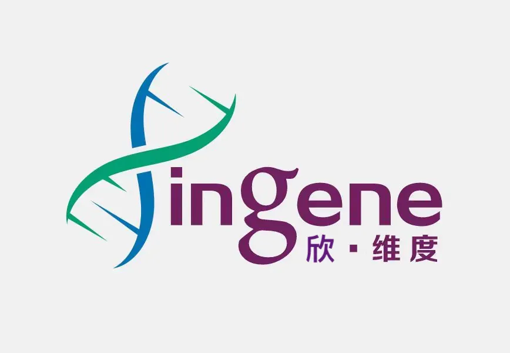
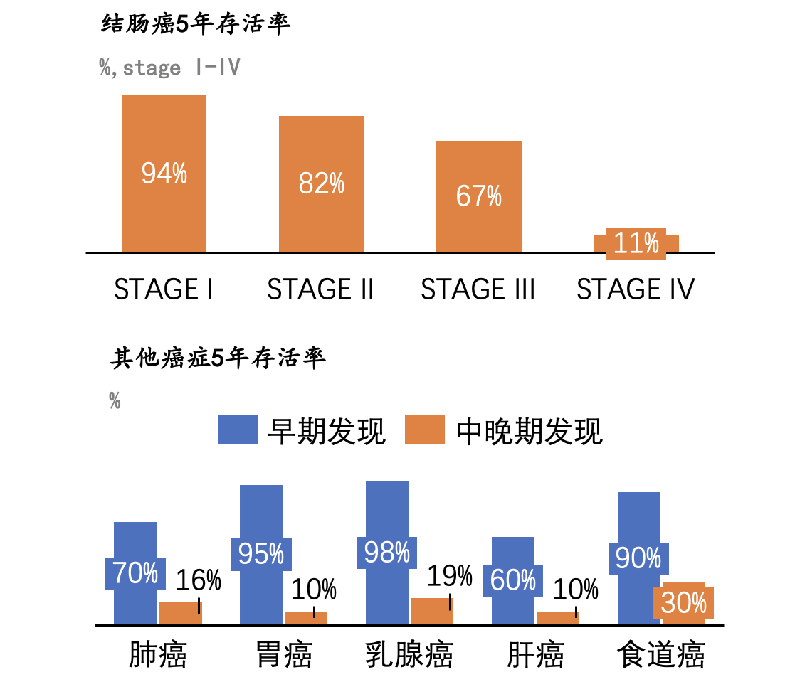
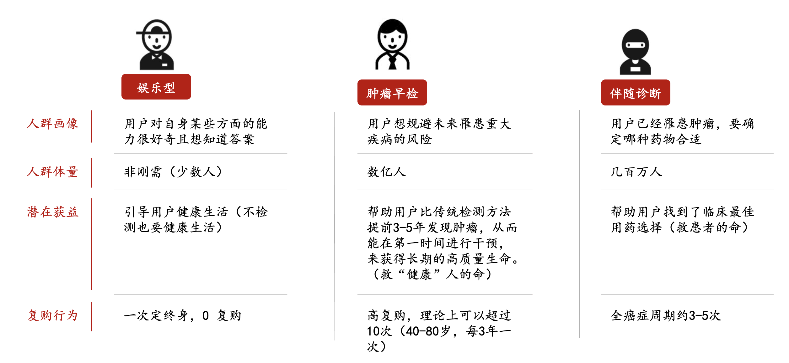
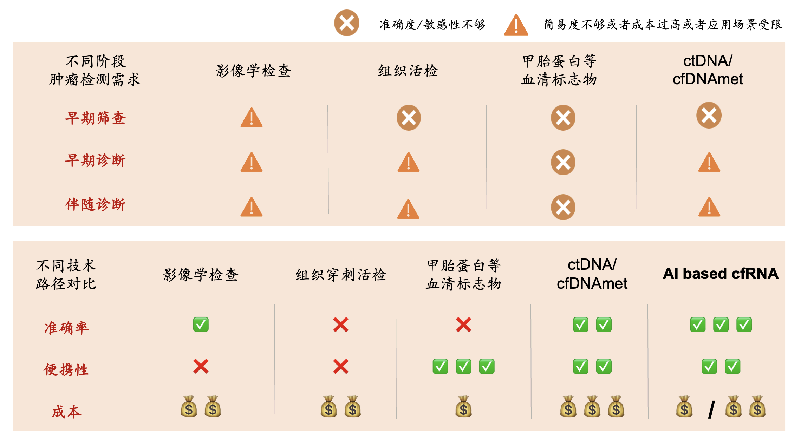
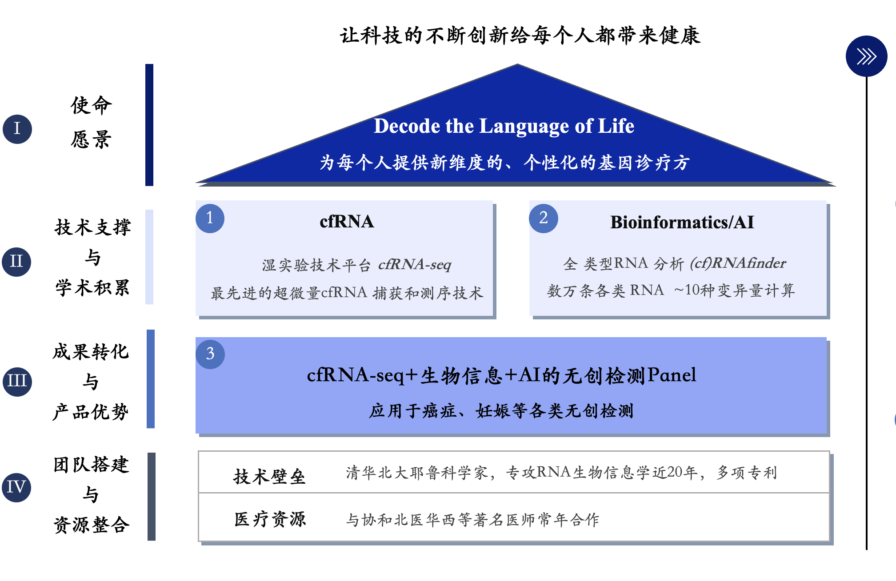

# 泛癌检测报告 - 202305080001

**目录**

* TOC
{:toc}

---

尊敬的用户:

您好！ 感谢您信任并选择本公司的“泛癌症cfRNA早期筛查”产品， 为自己的健康保驾护航！

癌症病人的肿瘤细胞会释放RNA到人体血液中。我们通过检测血液循环系统中的**游离RNA** (**cfRNA**: cell free RNA)，可以捕获到来源于癌症的RNA，从而实现对癌症的早期发现。新维度基因在实验检测技术和人工智能算法两方面均具有深厚的技术积累，其独有的DETECTOR-seq检测技术可以实现痕量游离RNA的捕获和检测，搭配专利人工智能算法，可以检测处于早期的微弱癌症信号，真正实现癌症的早期发现和预警。

“上工治未病”，通过早期筛查，医生就可以对早期癌症及癌前病变进行有效地发现，提前发现潜伏癌症，及时干预，大幅度提高病人的生存和康复期望。

希望我们的产品能为您的健康贡献一份绵薄之力，并衷心祝愿您和您的家人身体健康!

---

## 基本信息

*  **样本编码：202305080001**
*  姓名：李四
*  性别:  男				
*  年龄：56
*  手机（登录账户名）:  18812345678			
*  采样点：北京阅微基因
*  采样日期:  2023.04.19.
*  接收日期:  2023.04.19.						
*  报告日期:  2023.05.12.

## 项目流程

癌症检测项目的实验流程如下图所示。为了保证检测结果准确可靠，我们建立了严格的质量控制体系，分别在血液样本，RNA文库和测序数据三个关键节点上都设立了质量检查点。

## 质控报告

您本次检测项目的综合质量评估结果为  **合格**
  具体请参见下表：

| **质控阶段** | **质控参数**    | **质控结果** | **质控标准** |
|----------|-------------|----------|----------|
| **样本质控** | RNA含量(Cq)   | 27       | < 32     |
|      | DNA污染(Cq)   | 40       | > 35     |
|      | 微生物污染(ΔCq)  | -5       | < 5      |
| **文库质控** | 片段大小(bp)    | 350      | 200~500  |
|      | 文库浓度(ng/μl) | 10       | >1       |
|      | 接头二聚体(%)    | 0        | <5       |
| **数据质控** | 原始数据(M)     | 10       | > 4      |
|      | 有效数据(M)     | 9.8      | > 3.8    |
|      | 核糖体数据(%)    | 5        | < 20     |
|      | 线粒体数据(%)    | 5        | < 20     |
|      | 基因组数据(M)    | 6        | > 2      |
|      | 去重后数据(M)    | 1        | > 0.1    |
| **综合评估** | **合格** |||

**注：**

1. DNA污染(Cq)：使用RT-qPCR对样本中的DNA污染进行定量的结果。
2. 微生物污染(ΔCq)：使用RT-qPCR对样本中的细菌核酸污染进行定量的结果。
3. 有效数据(M)：去除低质量测序数据并剪切掉接头序列后得到的测序数据量。
4. 去重后数据(M)：使用分子标签去除重复序列之后得到的测序数据量。

## 检测结果

* 您本次检测的最终评估结果为 **阴性**
* 您体内的肿瘤信号强度为 **0.23**  （正常人参考区间为： 0 - 2.3）

具体请参见以下说明：

### 1. 体内肿瘤信号强度评估

* 本报告中的肿瘤信号强度指的是您的血液样本中癌症相关基因CYTOR（细胞骨架调节子RNA）相对参考基因GAPDH（甘油醛-3-磷酸脱氫酶）的丰度水平，计算公式为2^[-△Ct(CYTOR-GAPDH)]，该值越高，表明血液中的肿瘤信号强度越强，正常人的参考区间为： **0 - 2.3**
* 当前结果的肿瘤信号强度为 **0.23**。根据我们已有的临床数据，该结果意味着您处于低风险水平，未在您的血液样本中检测到异常的癌症RNA信号，提示您的「肝脏」罹患肿瘤的风险较低。该结果仅作为提示，不能完全排除相关风险，不作为最终诊断结果。

### 2. 癌症类型评估（仅在NGS检测报告中提供，此处为示例）

* 根据当前结果计算的肿瘤发生位置预测：「结直肠」癌的可能性最高为**10%**； 「肝」癌可能性为**5%**；「肺」癌可能性为 **5%**，其他位置可能性为 **2%**。

### 3. 全转录组基因测定数值（仅在NGS检测报告中提供，此处为示例）

基因测定值示例：

|Gene Name|RNA_expression_TPM|chimeric_count|promoter_count|promoter_max|promoter_min|promoter_mean|splicing_count_A3SS|splicing_entropy_A3SS|splicing_max_A3SS|splicing_min_A3SS|splicing_mean_A3SS|splicing_count_A5SS|splicing_entropy_A5SS|splicing_max_A5SS|splicing_min_A5SS|splicing_mean_A5SS|splicing_count_MXE|splicing_entropy_MXE|splicing_max_MXE|splicing_min_MXE|splicing_mean_MXE|splicing_count_RI|splicing_entropy_RI|splicing_max_RI|splicing_min_RI|splicing_mean_RI|splicing_count_SE|splicing_entropy_SE|splicing_max_SE|splicing_min_SE|splicing_mean_SE|ASE_count|ASE_entropy|ASE_max|ASE_min|ASE_mean|ASE_mean_all|ASE_mean_window_1|ASE_mean_window_2|ASE_mean_window_3|editing_count|editing_entropy|editing_max|editing_min|editing_mean|editing_mean_all|editing_mean_window_1|editing_mean_window_2|editing_mean_window_3|SNP_count|SNP_entropy|SNP_max|SNP_min|SNP_mean|SNP_mean_all|SNP_mean_window_1|SNP_mean_window_2|SNP_mean_window_3|
|:----|:----|:----|:----|:----|:----|:----|:----|:----|:----|:----|:----|:----|:----|:----|:----|:----|:----|:----|:----|:----|:----|:----|:----|:----|:----|:----|:----|:----|:----|:----|:----|:----|:----|:----|:----|:----|:----|:----|:----|:----|:----|:----|:----|:----|:----|:----|:----|:----|:----|:----|:----|:----|:----|:----|:----|:----|:----|:----|
|G071662|0|0|0|0|0|0|0|0|0|0|0|0|0|0|0|0|0|0|0|0|0|0|0|0|0|0|0|0|0|0|0|0|0|0|0|0|0|0|0|0|0|0|0|0|0|0|0|0|0|0|0|0|0|0|0|0|0|0|
|LINC01109|0|0|0|0|0|0|0|0|0|0|0|0|0|0|0|0|0|0|0|0|0|0|0|0|0|0|0|0|0|0|0|0|0|0|0|0|0|0|0|0|0|0|0|0|0|0|0|0|0|0|0|0|0|0|0|0|0|0|
|hsa_circ_0130184|0|0|0|0|0|0|0|0|0|0|0|0|0|0|0|0|0|0|0|0|0|0|0|0|0|0|0|0|0|0|0|0|0|0|0|0|0|0|0|0|0|0|0|0|0|0|0|0|0|0|0|0|0|0|0|0|0|0|
|hsa_circ_0138435|0|0|0|0|0|0|0|0|0|0|0|0|0|0|0|0|0|0|0|0|0|0|0|0|0|0|0|0|0|0|0|0|0|0|0|0|0|0|0|0|0|0|0|0|0|0|0|0|0|0|0|0|0|0|0|0|0|0|
|CEACAM8|1.5669|0|1|0.093708|0.093708|0.093708|0|0|0|0|0|0|0|0|0|0|0|0|0|0|0|0|0|0|0|0|0|0|0|0|0|0|0|0|0|0|0|0|0|0|0|0|0|0|0|0|0|0|0|0|0|0|0|0|0|0|0|0|
|AC008771.1|1.046|0|1|0.191437|0.191437|0.191437|0|0|0|0|0|0|0|0|0|0|0|0|0|0|0|0|0|0|0|0|0|0|0|0|0|0|0|0|0|0|0|0|0|0|0|0|0|0|0|0|0|0|0|0|0|0|0|0|0|0|0|0|
|MTHFD2P1|0|0|1|0.108952|0.108952|0.108952|0|0|0|0|0|0|0|0|0|0|0|0|0|0|0|0|0|0|0|0|0|0|0|0|0|0|0|0|0|0|0|0|0|0|0|0|0|0|0|0|0|0|0|0|0|0|0|0|0|0|0|0|
|hsa_circ_0008493|0|0|0|0|0|0|0|0|0|0|0|0|0|0|0|0|0|0|0|0|0|0|0|0|0|0|0|0|0|0|0|0|0|0|0|0|0|0|0|0|0|0|0|0|0|0|0|0|0|0|0|0|0|0|0|0|0|0|
|AC135048.2|0|0|0|0|0|0|0|0|0|0|0|0|0|0|0|0|0|0|0|0|0|0|0|0|0|0|0|0|0|0|0|0|0|0|0|0|0|0|0|0|0|0|0|0|0|0|0|0|0|0|0|0|0|0|0|0|0|0|
|LINC02484|0|0|0|0|0|0|0|0|0|0|0|0|0|0|0|0|0|0|0|0|0|0|0|0|0|0|0|0|0|0|0|0|0|0|0|0|0|0|0|0|0|0|0|0|0|0|0|0|0|0|0|0|0|0|0|0|0|0|
|RN7SL145P|0|0|0|0|0|0|0|0|0|0|0|0|0|0|0|0|0|0|0|0|0|0|0|0|0|0|0|0|0|0|0|0|0|0|0|0|0|0|0|0|0|0|0|0|0|0|0|0|0|0|0|0|0|0|0|0|0|0|

*  [全转录组基因测定数值表 - 预览链接]()
*  [全转录组基因测定数值表 - 下载链接]()

### 4. 报告文件下载（仅在NGS检测报告中提供，此处为示例）

* [PDF预览链接]()
* [PDF下载链接]()

## 相关健康知识和建议

### 为什么要做癌症早筛（早期筛查肿瘤信号）？

癌症是一类恶性肿瘤的统称，是指一种由于机体某些细胞不断异常增生，最终形成的肿瘤，它可以侵犯身体的各个部位，并可能通过血液或淋巴系统扩散到其他组织和器官。癌症是一种复杂的疾病，它可能由多种因素引起，包括遗传、环境和生活方式等因素，同时也具有一定的可预防性、可治疗性和可控性。

国务院健康中国行动（2019－2030）明确提出，癌症严重危害群众健康，我国将从制定筛查指南、加大推广力度、优化筛查技术方案、提高基层筛查能力、加大科普宣传等方面入手，改善癌症早期筛查的问题。

世界卫生组织国际癌症研究机构发布的2020年全球最新癌症数据表明，2020年全球有1929万例新发癌症病例和996万例癌症死亡病例；其中我国新发癌症病例和死亡病例分别高达457万和300万，分别占比 23.7%、30%，均位居全球第一，这对我国人民的健康与幸福生活造成了极大威胁。

肿瘤早筛是指用快速、简便的方法，从大量看起来健康、尚未出现症状的目标人群中筛选出极少数肿瘤高危群体。对于大多数的实体瘤而言，最佳的治疗时机就是在原发肿瘤发生淋巴结转移和周边组织侵袭之前。早期的原发性肿瘤可以采用手术方式切除肿瘤病灶，通常可以得到比较好的预后，甚至可以达到治愈的效果。以结直肠癌为例，中国人群结直肠癌的五年生存率在 I、II、III、IV 期分别为 94%、82%、67%和 11%。因此，肿瘤早发现和早诊断对于提升患者的生存率至关重要，同时也能减少国家和个人的医疗支出负担：结直肠癌癌前病变的治疗费用约2万元，而晚期（IV 期）的治疗费用超过25万元；晚期肺癌患者治疗费用是早期治疗费用的2倍以上。根据世界卫生组织数据，1/3的癌症可以通过早期发现得到治疗。“上工治未病”，有效的早期诊断对癌症治疗有极大帮助。

癌症早筛的意义主要体现在以下几点：

* **提高生存率**：癌症早期发现，及时治疗，能显著提高患者的生存率。对于很多癌症类型，早期诊断和治疗的五年生存率往往远高于晚期诊断的患者，**如上图所示，往往高5-10倍**。
* **降低治疗风险与费用**：早期癌症治疗方法较多，风险较低，患者身体损伤较小。而晚期癌症治疗费用高昂，疗效不佳，患者生活质量受到严重影响。
* **预防癌症扩散和转移**：癌症早期发现有助于防止癌症的扩散和转移。癌细胞的扩散和转移会导致病情恶化，严重影响患者生活质量和预后。
* **提高公众健康意识**：癌症早筛项目能提高公众对癌症的认识，增强健康意识，鼓励人们积极参与癌症预防和筛查。
* **推动医疗技术发展**：癌症早筛技术的发展有助于提高医疗技术水平，推动更多有效的诊断和治疗方法的研究和应用。

总之，癌症早筛具有重要的现实意义和价值。通过提高癌症早期发现率和治疗成功率，早筛有助于降低癌症对社会和个人的负担，提高患者的生活质量和生存期望。

### 癌症早筛技术的国内外研究最新进展

根据美国国立综合癌症网络指南（National Comprehensive Cancer Network guidelines）的推荐，目前临床可用的肿瘤筛查手段包括低剂量计算机断层扫描、肠镜检查、乳腺X线摄影和宫颈细胞学结合人乳头瘤病毒检测，分别适用于肺癌、结直肠癌、乳腺癌和宫颈癌的筛查。这些方法由于辐射危害或采用侵入式检查方法导致患者的依从性较差，其灵敏度和特异性仍存在提升空间。即便如此，对于其他大多数肿瘤而言，目前临床上仍缺乏公认的筛查方法。除了影像学和内窥镜等手段，人们也在积极开发基于生物标志物的肿瘤检验方法用以改善肿瘤的诊疗现状。

**蛋白质标志物**是比较传统的肿瘤液体活检标志物，已有多种蛋白标志物被广泛应用在肿瘤辅助诊断和术后管理等临床场景。例如肝癌的血清标志物甲胎蛋白（Alpha-fetoprotein，AFP）经常被用作原发性肝癌的辅助诊断和疗效监测。然而，蛋白标志物大多缺乏组织特异性，甚至缺乏肿瘤特异性。血清甲胎蛋白水平的增高并不一定是肝癌引起的，一些良性疾病如肝炎和肝硬化也会造成甲胎蛋白水平升高，妊娠期的孕妇血清中也能检测到甲胎蛋白阳性。有研究发现，睾丸癌、卵巢癌、胰腺癌和结直肠癌等患者的血清甲胎蛋白水平也会出现一定程度的升高。此外，约有30~40%的原发性肝癌患者的血清甲胎蛋白检测呈阴性，存在一定程度的漏检风险。因此，传统的蛋白质标志物由于灵敏度和特异性不高，很难对癌症进行准确的诊断和预后，只能作为肿瘤风险的提示。

随着精准医疗技术的发展，液体活检领域中研究者通过检测**循环肿瘤DNA**（ctDNA，circulating tumor DNA）变异进行癌症诊断、分型和用药指导。人类体液中存在游离的cfDNA（cfDNA，cell-free DNA），其主要来源于细胞凋亡、细胞坏死和细胞分泌。其中， ctDNA是指包含肿瘤特异性突变信息的癌症相关cfDNA。然而，肿瘤通常只有发展到中晚期才能释放出足够被准确检测的ctDNA到体液中，因此ctDNA检测多用于局部晚期或远处转移的肿瘤。

近年来，除了ctDNA变异之外，**细胞外DNA甲基化**也开始被作为癌症诊断和组织溯源的标志物。液体活检领域的领军企业Grail通过比较cfDNA的多种特征，包括单核苷酸突变、DNA拷贝数变异、DNA甲基化和DNA片段化模式等，鉴定出DNA甲基化在癌症检测中拥有较好的表现效果【1】。Grail在2021年发布了细胞外基因组图谱（Circulating Cell-free Genome Atlas，CCGA）项目的最新研究成果【2】，该项目在4077名参与者、包含50多种癌症类型的独立验证临床队列中，利用cfDNA甲基化进行癌症诊断和组织溯源，准确度达到了88.7％；但是对于早期（I期和II期）癌症，虽然特异性按照早期筛查的要求很好地控制在了99.5%左右，其灵敏度却只有16.8%（I期）和40.4 %（II期），仍存在较大的提升空间。

**细胞外游离RNA**（cfRNA，cell-free RNA）具有高度的动态性、敏感性和组织特异性。细胞可以选择性富集和主动分泌不同种类的RNA，参与细胞间的通讯。越来越多地研究表明各类RNA在液体活检中具有重要的临床价值。自2008年以来，人们便开始关注血浆和血清中稳定存在的miRNA作为癌症诊断标志物的可能性。国内的研究者在该领域取得了多项开创性和引领性的工作成果。作为较早在血液样本中发现细胞外miRNA的研究组，南京大学张辰宇教授团队系统地检测了miRNA在胰腺癌和非癌对照人群中的表达模式，鉴定出了包括miR-21和miR-25等若干显著差异表达的miRNA【3】。其中，基于血清miR-25的胰腺癌检测试剂盒已于2015年获得了国家药品监督管理局的批准（国械注准20153402055）。此外，复旦大学附属中山医院的樊嘉院士团队发现血浆miRNA可以将肝癌患者从健康人、乙型肝炎和肝硬化患者中鉴别出来【4】。基于这项研究的肝癌检测试剂盒（7种微小核糖核酸检测试剂盒）也已获得国家药品监督管理局的三类医疗器械注册证和生产许可证（国械注准20173403299），目前已经在国内多家临床中心推广使用。随着测序技术的进步和发展，越来越多的研究开始通过高通量测序的方法系统地研究体液中的各类长RNA，主要包括mRNA、lncRNA和circRNA等。2018年，研究者在Science杂志上发表了一项使用血浆细胞外RNA进行胎龄和早产预测的研究【5】。随后，该项研究成果也被《麻省理工科技评论》评为 2019 年“全球十大突破性技术”之一。2022年初，Nature杂志发表的两项研究先后都揭示了血液中游离的长链RNA分子在妊娠早期预测先兆子痫的潜力，母体血液样本的转录组特征可以独立于临床因素准确地跟踪妊娠进展【6，7】。体液RNA的检测通过提供基因组变异与转录组动态变化的双重信息，可以准确地用于无创检验和疾病状态监测，为癌症等疾病的早期诊断提供了比cfDNA和蛋白更优的理论与实验支持。

参考文献：
* 【1】Jamshidi, A., et al. (2022). Evaluation of cell-free DNA approaches for multi-cancer early detection. Cancer Cell 40, 1537-1549 e1512. 10.1016/j.ccell.2022.10.022.
* 【2】Klein, E.A., et al. (2021). Clinical validation of a targeted methylation-based multi-cancer early detection test using an independent validation set. Annals of Oncology 32, 1167-1177.
* 【3】Chen, X., et al. (2008). Characterization of microRNAs in serum: a novel class of biomarkers for diagnosis of cancer and other diseases. Cell Research 18, 997-1006. 10.1038/cr.2008.282.
* 【4】Zhou, J., et al. (2011). Plasma microRNA panel to diagnose hepatitis B virus-related hepatocellular carcinoma. J Clin Oncol 29, 4781-4788. 10.1200/JCO.2011.38.2697.
* 【5】Ngo, T.T.M., et al. **(2018). Noninvasive blood tests for fetal development predict gestational age and preterm delivery. Science** 360, 1133-1136. 10.1126/science.aar3819. 
* 【6】Moufarrej, M.N., et al. **(2022). Early prediction of preeclampsia in pregnancy with cell-free RNA. Nature** 602, 689-694. 10.1038/s41586-022-04410-z.
* 【7】Rasmussen, M., et al. **(2022). RNA profiles reveal signatures of future health and disease in pregnancy. Nature** 601, 422-427. 10.1038/s41586-021-04249-w.

###  我们可以通过血液检测哪些疾病 ？

我们的检测不同于其他的娱乐型基因检测，我们的方法是检测人的肿瘤细胞中流到血液里面的癌症信号。利用血液等体液进行疾病检测的技术称为**液体活检**，随着精准医疗的提出和下一代测序技术的发展，液体活检（血液等体液中的细胞、分子检测）已经成为癌症研究的一个主要方向和前沿热点。液体活检可以对患者进行血液分子谱表征从而反应体内组织基因组变异和转录组动态变化，预测潜在疾病风险和癌症部位，指导制定治疗决策，监测预后反应，并对出现的治疗耐药性和疾病复发进行提前预警。

肿瘤组织活检由于需要对组织穿刺采集，将给病人造成较大的痛苦和经济负担，同时还受限于肿瘤组织样本的异质性和可及性、难以全面地反映肿瘤组织的遗传特征，也无法对疾病状态进行实时动态监测。肿瘤液体活检，是通过对血液等体液中循环的生物标志物进行检测来分析肿瘤。相比于组织活检，无创或微创诊断的液体活检具有痛苦小，成本低，可以方便地重复取样进行病程监测等优势。总的来说，肿瘤液体活检以一种微创、可重复的方式表征肿瘤，对于癌症患者疾病风险预测和疾病状态监测都具有重要的临床应用价值

更多的，液体活检主要可以检测以下多种疾病:

* **癌症**:液体活检可以检测多种癌症,如前列腺癌、食道癌、胃癌、结肠癌、胰腺癌等。通过检测血液或其他体液中的癌细胞DNA、RNA、蛋白质等生物标志物来筛查癌症或监测治疗效果。
* **心血管疾病**:可以通过检测血清生物标志物如肌酸激酶同工酶、B型利钠肽等来评估心肌损伤和心血管疾病风险。
* **炎症性疾病**:可以检测相关炎症标志物如C反应蛋白、肿瘤坏死因子等来监测类风湿关节炎、炎症性肠病等的病情与治疗效果。
* **自身免疫性疾病**:可以通过检测特异性自身抗体,如抗核抗体等来诊断系统性红斑狼疮、干燥综合征等自身免疫性疾病。
* **感染性疾病**:可以检测病原体的DNA或RNA,以及特异性IgM抗体来诊断流感、肺炎、梅毒、丙型肝炎等感染性疾病。

### 我们的检测技术有哪些研究基础 ？

如上所述，我们的方法是检测人的肿瘤细胞中流到血液里面的癌症信号。同时，我们通过人工智能 AI 模型学习已经患癌的病人的癌症信号，建立计算模型。这个 AI 模型有一个很大的优点，就是他会通过检测过的人群的不断增大而不断学习和迭代，从而会更敏感、更精准。

我们基于基因组学和生物信息学，通过开发体液cfRNA微量测序技术和机器学习方法 （**AI based cfRNA**)，在体液中发现和鉴定与癌症发生发展相关的新型cfRNA标志物，应用于国内高致死癌症的早期诊断和预后辅助治疗。

cfRNA指的是胞外RNA，又称exRNA，包括多种类型：miRNA,Y RNA,circRNA,lncRNA等。RNA标志物与DNA和蛋白标志物相比，具有更好的敏感性、组织特异性和多样性，为更好的临床检验带来了新的期望。我们在新型非编码RNA和生物信息学研究方面积累了丰富经验。

基于此，我们将在癌症病人体液（如血液）中发现和分析标志癌症发生发展的新型exRNA/cfRNA，并整合现有标志物构建多重标志物的智能模型，在大样本上进行验证，建立具有更高精准度和可重复性的无创检验方法。

我们在非编码RNA(ncRNA)测序和生物信息学研究中积累了近20年的丰富经验：

* 我们在模式生物和肝癌样本中通过测序和生物信息学分析发现了很多新的lncRNA（Science 2010; Nature 2012; Nature 2014; Genome Biology 2017; Cell 2019; Cell Research 2020; PNAS 2020), 其中有不少具有很好的标志物特性；

* 2015年起，我们在清华的实验室开始大力发展针对体液无创检测技术的研究，我们已经克服了体液游离RNA易降解及微量建库的技术难题，开发了自主研发的超微量RNA测序技术i-SMART(专利号：201810607652X）和基于机器学习和人工智能的生物信息学方法RNAfinder（专利号：2016108069288）和exSEEK（专利申请号：202010618721.4）(Genome Res. 2011; Nucleic Acids Res. 2015; Nucleic Acids Res. 2017a)；

* 我们发现了一些新的exRNA标志物（专利号:2018110094643；专利号：202010927225.7) (Nature Communications 2017; Clinical Chemistry 2019; Theranositics 2021)；

* 我们积累了癌症相关的RNA数据库（著作权号：2016R11S367236）(Nucleic Acids Res. 2017b; Nucleic Acids Res. 2019，Nucleic Acids Res. 2022)。

以上成果都为癌症无创检测试剂的开发提供了有力的支持。

###  我们的泛癌检测可以筛查哪些癌症类型 ？

我们的方法是检测人的肿瘤细胞中流到血液里面的癌症信号，我们会通过人工智能 AI 模型学习已经患癌的病人的癌症信号，建立计算模型。现在我们的AI 模型是从 **常见五大癌症（结肠癌、胃癌、肝癌、食道癌、肺癌）** 的上千个病人的数据上学习来的，可以很好地诊断常见五大癌症（结肠癌、胃癌、肝癌、食道癌、肺癌）。注意我们的 AI 模型目前还没有学习其他癌症类型，例如乳腺癌等。

但是各个类型的癌症会有一些共同和相似的信号，所以现在的 AI 模型很可能也会检测出乳腺癌的病人。在我们一边给更多的人检测的同时，我们也在不断积累临床数据，这样我们的 AI 模型就可以不断学习新的数据，学会检测更多的癌症类型的信号，检测能力也会更敏感、更精准。

## 技术成果相关报道

2022.07. | [王鹏远/鲁志/徐振江团队合作发表泛癌早诊研究新成果](https://mp.weixin.qq.com/s/sbM2M_uZhuUXttdumdBCJQ)
2020.11. | [清华大学鲁志、海军军医大学殷建华和国家肝癌科学中心陈磊课题组揭示针对肝癌AFP阴性诊断和早期诊断的血液非编码RNA标志物](https://www.seqchina.cn/13047.html)
2019.12. | [“披着羊皮的狼”——癌症转移的新面纱 - 清华大学王栋、鲁志Cell Res发文揭示肿瘤转移新模型](https://www.seqchina.cn/11102.html)
2019.5. | [清华大学鲁志研究团队与天津、上海研究团队联合发布液体活检新成果！多种非编码RNA结构域或可作为稳定的肝癌无创诊断标志物](https://www.seqchina.cn/9578.html)
2017.3. | [清华大学，东方肝胆医院发表Nature子刊解析与癌症有关的lncRNA](https://www.ebiotrade.com/newsf/2017-2/2017228174413583.htm)
2016.11. | [利用生物信息学发现基因组暗物质– 清华大学鲁志实验室非编码RNA软件系列介绍](https://m.sohu.com/n/472285488/)

## 相关专利和科研成果

- 基于机器学习的生物信息方法RNAfinder（专利号：201610806928.8）(Science 2010; Genome Res. 2011; Nucleic Acids Res. 2015;2017a;2018)

- 癌症相关的RNA数据库（著作权号：2016R11S367236）(Genome Biology 2017; Nucleic Acids Res. 2017b;2019)

- 针对肝癌早期检测和复发监测的一个新型非编码exRNA标志物（专利号:201811009464.3）(Nature Comminications 2017; Clinical Chemistry 2019)

- 痕量RNA捕获和测序技术i-SMART (专利号：201810607652X）(Briefings in Bioinformatics 2018; Cell Research 2020)

- 一种用于肝细胞癌早期筛查和复发监测的系统 (专利号：202010927225.7)（Theranostics 2021)

- 体液样本中鉴定新型exRNA生物标志物的机器学习方法 (专利申请号：202010618721.4)

##  相关已发表科研论文

- [I. RNA-finder](https://www.ncrnalab.org/publications/pub.html#i-rna-finder)
- II. RNA-target
  - [II. 1 Protein targeting RNA](https://www.ncrnalab.org/publications/pub.html#ii-1-protein-targeting-rna)
  - [II. 2 siRNA/shRNA targeting RNA](https://www.ncrnalab.org/publications/pub.html#ii-2-sirnashrna-targeting-rna)
  - [II. 3 Small molecule targeting RNA](https://www.ncrnalab.org/publications/pub.html#ii-3-small-molecule-targeting-rna)
- [III. RNA-structure/structurome](https://www.ncrnalab.org/publications/pub.html#iii-rna-structurestructurome)
- [IV. RNA-med](https://www.ncrnalab.org/publications/pub.html#iv-rna-med)

## 相关在研项目

- 国家自然科学基金 面上项目，3217040246，体液多组学数据整合的生物信息学研究及其在癌症无创检测上的应用，2022-2025 主持

- 国家自然科学基金 面上项目，81972798，针对癌症诊断和预后的新型体液exRNA标志物的研究，2020-2023 主持

- 国家“凤凰工程” 技术创新开放共享课题，2021-NCPSB-005，多组学整合的生物信息学研究，2021/07-2023/06 主持

- 清华大学精准医学研究院 精准医疗战略项目， 基于多组学数据的智能化中晚期肝癌转化治疗决策研究，2022/08-2025/07 主持

- 清华大学国强研究院 人工智能与机器人项目，2021GQG1020，生物调控网络知识启发下的新型AI模型的构建及其在癌症早诊上的应用，2022/04-2024/03 主持

- 清华大学春风基金，2021Z99CFY022，针对微生物感染的新型核酸检测技术研发，2021/09-2023/09 主持

- Bayer AI制药项目, AI driven drug design targeting RNAs，2023-2024 主持

## 承诺和声明

上工治未病，我们的使命是要帮助人们更早期的发现癌症。我们相信，这种使命感以及为此付出的实践和努力，将帮助我们理解和治疗人类疾病，并最终认识和提高我们自己。

**特别声明:**

- 本公司确保本报告为申请人所提供的受检者样本的检测结果。
- 本公司仅保证本次合格样品检测结果的正确性，不对一致性负责。
- 因为癌症是极为复杂的疾病，其发生发展是由多因素、多阶段、多基因共同作用的结果，分析结果仅提示癌症的患病风险，风险度高不表示该个体一定会患病，同时风险度低不表示该个体一定不会患病。

